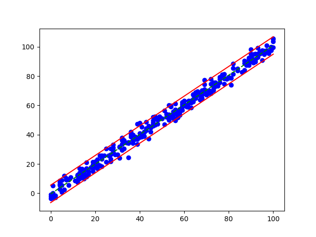

# Machine Learning Package
###### Author: Riley Kopp
Enclosed is the detailed descriptions of each ML algorithm. See the repo's readme for details on installing the package.

**For examples of each algorithm being used on real data, please see [examples.py](examples.py).**

## Table of Contents
- [Perceptron](#Perceptron)
- [Linear Regression](#Linear-Regression)
- [MultiVariate Linear Regression](#MultiVariate-Linear-Regression)
- [Logistic Regression](#Logistic-Regression)
- [Decision Stump](#Decision-Stump)
- [K Nearest Neighbors](#K-Nearest-Neighbors)
## Perceptron
### How to Use:
To use the perceptron in your own code use the following line:
```
from ML import Perceptron
```

Then create the object of the perceptron by running:
```
classifier = Perceptron(<scale>, <epochs>)
```
Then fit the model by calling:
```
classifier.fit(X, y)
```
Where `X` is an `m x n` matrix where `m` is the number of training data points and `n` is the number of features within 
each datapoint and `y` is a vector of size `m` that contains the label of the corresponding datapoint in `X`.

Once the model is fitted, there are a few more functions that can be run. To view the current weights of the perceptron,
call `classifier.get_weights()`, this will return a vector of size `w` where `w = n + 1` and `w_0` is the bias of the
classifier.

To run the classifier on testing data, call `classifier.perdict(X)`


### What Does the Perceptron Do?
At a high level, the perceptron is a binary classifier. Meaning it can separate items into two classes based on their 
features. At a lower level, the perceptron takes a dot product of the feature set `X_i` and the weight vector `w` and 
adds the bias. From there the sum of the dot product and the bias, `u`, is run through the following step function:
```
S(u) = u > 1 ? 1 : -1
```

The weights are determined during `fit()` using the following equation:
```
w = w + (y_actual - y_predicted) * scale * X_i)
```

And the bias is determined by using:
```
bias = bias + (y_actual - y_predicted) * scale)
```

Both `w` and `bias` are updated after every prediction using the following algorithm:
```
For Each epoch:
    error = 0
    For i in X:
        y_predicted = classifer.predict(i)
        w = w + (y_actual - y_predicted) * scale * X_i)
        bias = bias + (y_actual - y_predicted) * scale)
        error += abs(y_actual - y_predicted)
    End
    If error = 0
        break
    End
End
```

Once the Perceptron is fit, the Perceptron can be run on test data.

[Code](Perceptron.py)

[Example](examples.py#L7-L33)

### Example Output:


## Linear Regression
### How to Use:
To use the Linear Regression Class in your own code use the following line:
```
from ML import LinearRegression
```

Then create the object of the Linear Regression Class by running:
```
classifier = LinearRegression()
```
Then fit the model by calling:
```
classifier.fit(x, y)
```
Where `x` is a vector of size `n` and contains the independent data points and where `y` is a vector of size `n` and 
contains the dependent data points.
  
Once the model is fitted, the functions `get_slope()` and `get_intercept()` can be called to obtain the constants for
linear equation that was fit to the data points.

This implementation also calculates a prediction interval value that can be obtained by calling `get_interval()`

### What Does Linear Regression do?
At a high level, Linear Regression is a minimization function designed to minimize the distance between the given
data points and the linear function being approximated by the model (referred to as the minimization of the residuals). 
At a lower level, the model is using a method of regression known as least squares. 

Least Squares approximates a line by minimizing the sum of the squares of the residuals. Where the residuals can be 
calculated using:
```
residual_i = y_i - F(x_i)
```

Where `F(x)` follows the standard form: `F(x) = m * x + b`

Once the residuals for all `i` are calculated, the goal becomes minimizing the sum of the squared residuals:
```
S = sum(residuals^2)
```

Which has the closed form solution:
```
m = dot(x - x_mean, y - y_mean) / sum(( x - x_mean) ^2)
b = y_mean - m * x_mean
```

The prediction interval is then calculated by bounding the error by 95%:
```python
y_hat = slope * x + intercept
err = sum((y - y_hat)**2)
deviation = sqrt(1 / (len(y) - 2) * err)
interval = 1.96 * deviation
```

[Code](LinearRegression.py)

[Example](examples.py#L36-L56)

### Example Output:


## MultiVariate Linear Regression
### How to Use:
To use the MV Linear Regression Class in your own code use the following line:
```
from ML import MultiVariateLinearRegression
```

Then create the object of the Linear Regression Class by running:
```
classifier = MultiVariateLinearRegression()
```
Then fit the model by calling:
```
classifier.fit(x, y)
```
Where `x` is an array of size `n x m` and contains the independent data points and where `y` is a vector of size `n` and 
contains the dependent data points.
  
Once the model is fitted, the function `get_weights()` can be called to obtain the constants for
linear equation that was fit to the data points where the first value in the returned vector is the bias.

### What Does Linear Regression do?
At a high level, Linear Regression is a minimization function designed to minimize the distance between the given
data points and the linear function being approximated by the model (referred to as the minimization of the residuals). 
At a lower level, the model is using a method of regression known as least squares. 

Least Squares approximates a line by minimizing the sum of the squares of the residuals. Where the residuals can be 
calculated using:
```
residual_i = y_i - F(X_i)
```

Where `F(x)` follows the standard form: `F(x) = bias + w_1 * x_1 + w_2 + x_2 ....`

To minimize the error or the residual, the model uses the following method:

```
error = prediction - y[index]

self._weights[0] = self._weights[0] - (self._learning_rate * error)
self._weights[1:] = self._weights[1:] - (self._learning_rate * error * x[index])
```


[Code](MultiVariateLinearRegression.py)

[Example](examples.py#L59-L80)

### Example Output:


## Logistic Regression
### How to Use:
To use the Logistic Regression Class in your own code use the following line:
```
from ML import LogistcRegression
```

Then create the object of the Linear Regression Class by running:
```
classifier = LogisticRegression()
```
Then fit the model by calling:
```
classifier.fit(x, y)
```
Where `x` is an vector of size `n` and contains the independent data points and where `y` is a vector of size `n` and 
contains the class of the data.
  
Once the model is fitted, the function `get_coeff()` can be called to obtain the constants for
linear equation that was fit to the data points where the first value in the returned vector is the bias.

### What Does Logistic Regression do?
Logistic Regression uses a sigmoid function to model binary output.
The sigmoid function:
```python
y = 1.0 / (1.0 + exp(-(c_0 + c_1 * x)))
```

Where the coefficients are created using a stochastic gradient descent model defined here:
```python
c_0 = c_0 + l_rate * error * yhat * (1.0 - yhat)
c_1 = c_1 + l_rate * error * yhat * (1.0 - yhat) * x
```

[Code](LogisticRegression.py)

[Example](examples.py#L111-L134)

### Example Output:


## Decision Stump
### How to Use:
To use the Stump Class in your own code use the following line:
```
from ML import Stump 
```

Then create the object of the Linear Regression Class by running:
```
classifier = Stump(steps)
```

Where steps is the number of thresholds to attempt.

Then fit the model by calling:
```
classifier.fit(X, y)
```
Where `X` is a matrix of size `m x n` where `m` is the number of data points and `n` is the number of features within
the datapoint and `y` is a matrix of size `m` and contains the labels corresponding to the data points in `X`.
  
Once the model is fitted, the functions `get_threshold()` and `get_dimension()` to get the threshold for the classifier
and the dimension that the model determined was the optimal for shattering the dataset. 

### What Does a Decision Stump do?
A Decision Stump is another version of a binary classifier. Unlike a perceptron, the decision stump can only shatter a
data set in one dimension. It does this by running the following algorithm:

```
For dimension in n
    min = minimum valued feature in the dimension
    max = maximum valued feature in the dimension

    step_size = (max - min) / steps

    For current_step between -1 and steps + 1
        For sign in  ['>' , '<=']
            threshold = min + j * current_step
            predicted_labels = classify(data_matrix, dimension, threshold, sign)

            error = sum(abs(labels - predicted_labels))

            If error < min_error
                min_error = error
                best_threshold = threshold
                best_dimension = dimension
            End
        End
    End
    
End
```

[Code](Stump.py)

[Example](examples.py#L82-L108)

### Example Output:


## K Nearest Neighbors
### How to Use:
To use the KNN Class in your own code use the following line:
```
from ML import KNN 
```

Then create the object of the Linear Regression Class by running:
```
classifier = KNN(k, data_set)
```

Where `k` is the number of points to consider in the KNN algorithm and `data_set` is the training data for the 
classifier. 
**Note:** `data_set` must be of size n x m where n is the number of data points and m is the count of the datapoint's 
features + 1. Where `data_set[:, -1]` is the classification of the datapoint.

Since there is no 'fitting' per se, the only function available is the `predict(data_point)` function. This function
accepts a single datapoint and returns the datapoint's predicted class. `data_point` must be of size 1 x (m - 1). 

### What K-Nearest Neighbors do?
KNN uses the Frobenius norm to measure the distance between our new data point and all other data points in the data set.
KNN then sorts the dataset based on their distances to the new point. Once the dataset is sorted, the classifier selects
the closest `k` points and counts them by class. The class with the highest number of neighbors to the new datapoint is
the predicted class of the datapoint.

[Code](KNN.py)

[Example](examples.py#L136-L150)

## SVM
### How to Use:
To use the SVM Class in your own code use the following line:
```
from ML import SMV
```

Then create the object of the Linear Regression Class by running:
```
classifier = SVM(epochs)
```

The class then must be fit with the following function:
```
classifier.fit(dataset)
```
Where the last column of the dataset is the class of the data point.

### What does the SVM do?
The support vector machine determines the best possible hyperplane for classification by maximizing the margin between 
the points and the hyperplane. 
 
### Example Output:


[Code](SVM.py)

[Example](examples.py#L149-L181)
